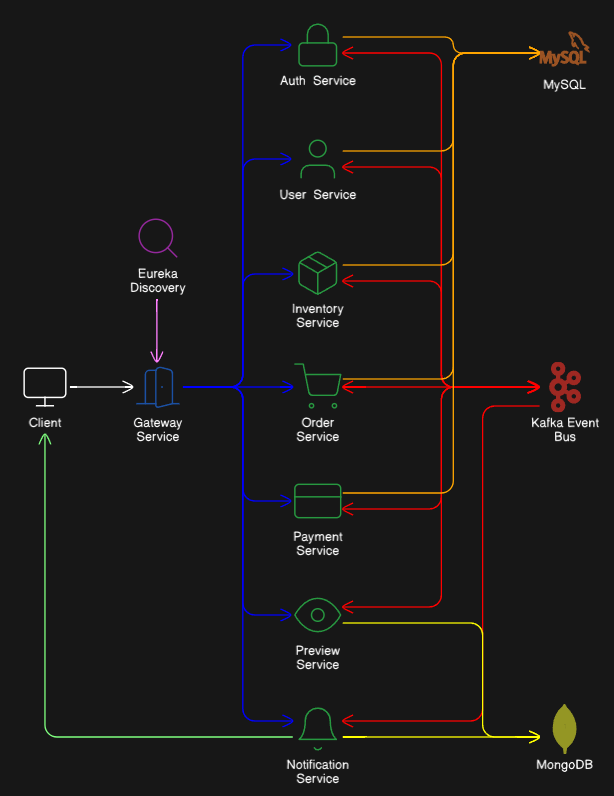

#  Microservices Marketplace Platform

[](https://www.oracle.com/java/)
[](https://spring.io/projects/spring-boot)
[](https://react.dev/)
[](https://vitejs.dev/)
[](https://www.docker.com/)
[](https://kafka.apache.org/)
[](LICENSE)


A **full-stack microservices marketplace** for second-hand item trading.  
Built with **Java Spring Boot (backend)** microservices architecture and **React + Vite (frontend)**, orchestrated via an **API Gateway**, and powered by **event-driven Kafka workflows**.

---

##  Table of Contents

- [Overview](#overview)
- [Architecture](#architecture)
- [Tech Stack](#tech-stack)
- [Features](#features)
- [Workflows](#workflows)
- [Project Structure](#project-structure)
- [Setup & Installation](#setup--installation)
- [Future Enhancements](#future-enhancements)
- [Why This Project Matters](#why-this-project-matters)
- [Screenshots](#screenshots)

---

##  Overview

- **Backend:** Spring Boot microservices, event-driven with Kafka  
- **Frontend:** React 18 + Vite, modern UI with Tailwind/MUI  
- **Infrastructure:** Docker, Docker Compose, Eureka Discovery, MySQL & MongoDB  
- **Deployment:** Nginx for frontend, containerized microservices  

---

##  Architecture

- **Microservices-based architecture**
- **Event-driven** communication with Kafka
- **Eureka** for service discovery
- **Redis** (planned) for caching and session management



---

##  Tech Stack

### Tech Stack Used
<div>
    <table>
        <tr>
            <td>
                <strong>Backend</strong>
            </td>
            <td>
                
                
                
                
                
                
                
                
                
                
                
            </td>
        </tr>
        <tr>
            <td>
                <strong>Frontend</strong>
            </td>
            <td>
                
                
                
                
                
                
                
                
            </td>
        </tr>
        <tr>
            <td>
                <strong>DevOps</strong>
            </td>
            <td>
                
                
                
                
            </td>
        </tr>
    </table>
</div>


---

##  Features

### Backend Services

**Authentication Service**
- JWT login & registration  
- Password hashing & validation  
- Role-based authorization  
- Refresh token support  
- **Uses:** MySQL, Kafka  

**User Service**
- CRUD operations for user profiles  
- Ratings for sellers/buyers  
- Wallet management & transaction history  
- Watchlist management  
- Emits Kafka events on updates  
- **Uses:** MySQL, Kafka  

**Inventory Service**
- CRUD operations for items  
- Image upload & deletion  
- Emits Kafka events for item changes  
- **Uses:** MySQL, Kafka  

**Preview Service**
- Generates optimized image previews  
- Filtering & search APIs  
- Subscribes to Kafka events from Inventory/User Services  
- **Uses:** MongoDB, Kafka  

**Order Service**
- Create & validate orders  
- Update order status (pending, completed, canceled)  
- Kafka-driven workflow for order processing  
- **Uses:** MySQL, Kafka  

**Payment Service**
- Stripe PaymentIntent integration  
- Payment confirmation & failure handling  
- **Uses:** MySQL, Kafka  

**Notification Service**
- Real-time notifications via WebSockets  
- Stores notifications in MongoDB  
- Subscribes to Kafka events from other services  
- **Uses:** MongoDB, Kafka  

**Discovery Service**
- Eureka registry for all services  
- Health check & heartbeat monitoring  

**API Gateway**
- Routes requests via Eureka  
- Aggregates responses (e.g., Inventory + User)  
- JWT validation & role-based access control  
- Optional: rate limiting, logging, IP whitelisting / CORS  

### Frontend

- **UI:** React 18 + Tailwind/MUI, responsive design  
- **Item Grid / Listings:** title, price, seller info, rating, filtering, pagination  
- **User Profile:** view/edit profile, avatar upload  
- **Wallet:** deposit, withdraw, transaction history  
- **Favorites / Watchlist:** mark items favorite, track price updates  
- **Notifications:** real-time updates via WebSocket  
- **Checkout & Payments:** Stripe PaymentIntent, secure validation  
- **Authentication:** login/registration, JWT handling, role-based views  

---

##  Workflows

### Order Processing
1. User places an order → `Order Service`  
2. Kafka event emitted  
3. `Inventory Service`, `Auth Service`, `User Service` validate the order  
4. If valid → `Payment Service` triggered  
5. Payment confirmed → `Order Service` updates status  
6. `Notification Service` pushes updates to frontend  
7. Seller & Buyer receive updates: created, confirmed, shipped, completed, canceled/refunded  

### Notification Workflow
- Any service emits an event → Kafka  
- `Notification Service` consumes event & stores in MongoDB  
- WebSocket pushes notification to frontend in real time  

### Login / Signup Workflow
1. User logs in or signs up → `Auth Service`  
2. `Auth Service` issues JWT + Refresh Token  
3. `User Service` provides profile & preferences  
4. `API Gateway` aggregates responses (Auth + User)  
5. User gains access based on roles  

### Inventory & Preview Workflow
1. User uploads an item → `Inventory Service`  
2. Item metadata stored in MySQL  
3. `Preview Service` generates previews → MongoDB  
4. Frontend requests previews from `Preview Service`  


---

##  Setup & Installation

### Prerequisites
- Java 17, Maven 3.9+  
- Node.js 20+  
- Docker & Docker Compose  

### Run Core Infrastructure
```bash
cd backend
docker-compose -f docker-compose.core.yml up -d
````

### Run Development Tools (optional)

```bash
docker-compose -f docker-compose.tools.yml up -d
```

### Run Backend Services Individually

```bash
cd auth-service
mvn spring-boot:run
# Repeat for other services
```

### Run Frontend (Dev Mode)

```bash
cd frontend
npm install
npm run dev
```

### Run Frontend in Docker

```bash
cd frontend
docker build -t marketplace-frontend .
docker run -p 3000:80 marketplace-frontend
```

---

##  Future Enhancements

* [ ] CI/CD pipelines (GitHub Actions)
* [ ] Monitoring & observability (Prometheus, Grafana, ELK)
* [ ] Redis caching for performance
* [ ] User-to-user chat service

---

##  Why This Project Matters

This project demonstrates:

* Event-driven microservices with Kafka
* Multi-database (SQL + NoSQL) design
* Secure, containerized deployment
* Production-grade frontend & backend integration

It is a **portfolio-grade project**, showcasing backend engineering, frontend development, and DevOps skills in one cohesive ecosystem.

---

## Screenshots

### Home Page & Filters
| Home Page | Filters |
| --------- | ------- |
|  |  |

### Item Page & Owner
| Item Page | Item Owner |
| --------- | ---------- |
|  |  |

### Account & Wallet
| Account Page | Wallet |
| ------------ | ------ |
|  |  |

### Orders & Order History
| Orders Page | Order History |
| ----------- | ------------- |
|  |  |

### Profile
| Profile Page |  |
| ------------ | - |
|  |  |
